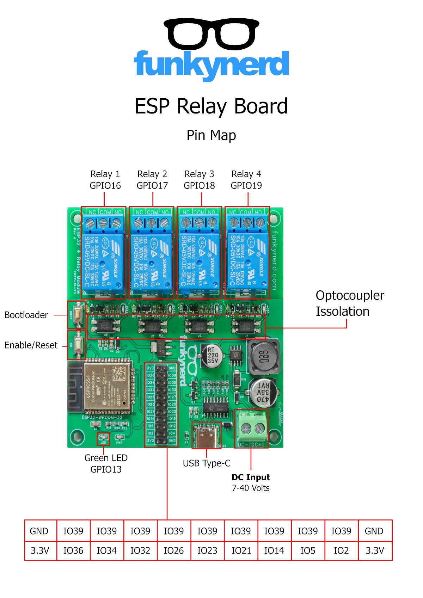

# FunkyNERD ESP32 Relay Board

## Quick start:

### Compiling Examples with **PlatformIO**

1. Install [Visual Studio Code](https://code.visualstudio.com/) and [Python 3.0](https://www.python.org/).
2. Install the PlatformIO extension by searching for `PlatformIO` in the VSCode extensions page.  When the installation is complete, restart VSCode.
3. Open the example project.  Go to file - > Open folder and select the FN_ESP_RELAY folder.
4. In the platforio.ini file select the project you want to compile and upload.
5. Connect your relay board to your computer with a USB cable.
6. To compile and upload, click the (→) symbol in the lower left corner.

You click the plug icon to monitor the serial output from the board while it runs.

## FN_ESP_RELAY_4 Pinout

